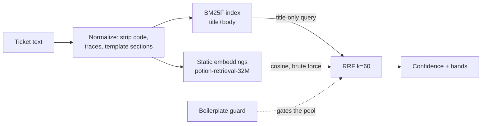

# Duplicate detection: what the spike found

A spike against the real Coverbase workspace (8,986 issues, 121 in Triage) to answer whether tlr can
tell a triager "does this already exist as a ticket?". Code lives in `spike/duplicates/`, which is
gitignored. This file is the record, so the idea does not come back unexamined.

The headline is that the retrieval works and the framing was wrong. Text similarity finds prior work at
roughly the best numbers the published literature reports, but only 18 of the 205 candidates it surfaced
over live Triage were actually duplicates. What it is good at is finding the ticket you should read
before writing yours, which is a different feature with a different UI.

## The problem, and why the obvious measurement lies

The workspace supplies its own labels. Every team has a `Duplicate` workflow state (664 tickets sit in
one) and Linear records `duplicate` relations, which yield **112 usable pairs across 84 clusters** once
each pair is ordered oldest-first and same-instant pairs are dropped.

Scoring against those pairs said the first working pipeline was good: recall@10 of 75%, at the top of
the 0.45-0.72 band the duplicate-bug-report literature reports. That number was measured honestly, with
a strictly chronological candidate pool (only tickets that existed when the query was filed), because a
random split lets the model see the future and, per Rakha et al., overstates performance badly enough
that older published results do not transfer.

Then calibration compared it against ordinary tickets, and the confidence assigned to a random ticket's
best match came out **higher** than the confidence assigned to a known twin (median 0.646 against
0.670). The retrieval was working. The objective was wrong.

The cause is structural, and any tool built here has to handle it:

| Population                         | Scale                                           | Why it breaks similarity                                                          |
| ---------------------------------- | ----------------------------------------------- | --------------------------------------------------------------------------------- |
| Per-customer onboarding checklists | 31 projects instantiate the same ~35 items      | "Set up SSO" exists 35 times across 31 projects, byte-identical, never duplicates |
| Auto-filed recurring errors        | 138 tickets titled `TypeError: Failed to fetch` | Each is a separate occurrence, not a restatement                                  |
| Machine-filed engineering batches  | 10 tickets tagged `[N+1]`                       | Shared tag and one shared label set, genuinely different work in each             |

12.3% of the corpus carries a title that appears more than once. These score at the very top (up to
0.92) because they are near-identical by construction, so no threshold placement separates them from
real duplicates. **A guard has to remove them before ranking, not down-weight them after.**

## What was tried, and what the numbers said

All of it runs locally with no API key and no network, per the decision to keep embeddings off a hosted
service. Anthropic does not sell an embeddings endpoint, so a hosted option would have meant a new
vendor either way.

The stack is deliberately small. BM25F is hand-rolled (~120 lines) because BM25F's actual point is
weighting term frequency across fields _before_ saturation, and every JS library surveyed does the
per-field sum the original paper argues against. The semantic channel is a model2vec static embedding
table, which is a lookup and a mean rather than a forward pass, so it needs no ONNX runtime and does not
break `deno compile`. Fusion is reciprocal rank fusion at k=60, which needs no score normalization
between a BM25 score with no scale and a cosine crowded into a narrow band.

Measured on this machine: 8,986 documents embed in **0.8s**, the whole 112-pair eval runs in under 3s,
and the model is 129MB on disk. Cost is zero and latency is not a design constraint at this size, which
removes most of the tradeoff space the roadmap anticipated. Brute-force cosine over 9k vectors is a few
milliseconds, so no vector index is warranted.

Retrieval quality, chronological pool, after the guard:

| Metric    | Pairwise (strict) | Cluster credit |
| --------- | ----------------- | -------------- |
| recall@1  | 36.6%             | 52.7%          |
| recall@5  | 67.9%             | 73.2%          |
| recall@10 | 72.3%             | 77.7%          |
| recall@50 | 88.4%             | 90.2%          |
| MRR       | 0.513             | 0.631          |

Cluster credit counts a hit on any member of the same human-linked duplicate cluster. Duplicate
relations are transitive but recorded pairwise, so three tickets describing one bug may be linked A-B
and C-B with A-C left unrecorded; surfacing C answers the triager's question and lands them on the same
merge. The pairwise column is what compares to the literature, the cluster column describes the feature.

### Things that did not work, recorded so they are not retried

- **Structural signals are a wash.** Same-team, label overlap, and a recency prior each traded recall@1
  for recall@20 without moving MRR. This matches the literature finding that categorical fields buy at
  most a few percent, and it has a local cause: 107 of 112 gold pairs are already same-team, so team
  carries almost no discriminating information here
- **The description helps as an index and hurts as a query.** Querying with title plus full body cost
  4.6 MRR points against querying with the title alone. Indexing the body still helps, so the answer is
  an asymmetric query rather than dropping the field
- **A smaller model is not cheaper in the way that matters.** potion-base-8M (30MB) matched
  potion-retrieval-32M on MRR but lost 4.5 points of recall@50, which is precisely the tail a reranker
  would work on
- **Semantic-only retrieval loses to lexical.** Static embeddings alone reached MRR 0.468 against 0.524
  for BM25F. Fusing them beat either, which is the case for keeping both channels rather than replacing
  one

## Precision, which the labels cannot measure

The 112 pairs measure recall only. A top-ranked candidate for an unlabeled ticket may be a real
duplicate nobody linked, so it cannot be counted as a false alarm. Precision needed adjudication, so the
sweep was run over all 121 live Triage tickets and **every one of the 215 surfaced candidates was judged
DUP / RELATED / NO against the ticket text**, with the rubric biased toward RELATED whenever the call
was close. Verdicts are in `spike/duplicates/verdicts.txt`.

| Band                 | n   | DUP | RELATED | NO  |
| -------------------- | --- | --- | ------- | --- |
| likely (>= 0.75)     | 22  | 45% | 50%     | 5%  |
| possible (0.55-0.75) | 71  | 6%  | 68%     | 27% |
| below 0.55 (silent)  | 112 | 4%  | 53%     | 44% |

Confidence does order the verdicts (mean 0.749 for DUP, 0.570 for RELATED, 0.523 for NO), and the bands
mean something: on gold queries, top-1 is correct 83% of the time in the `likely` band against 24% in
`possible`. The guard is what made this true. Before it, the `likely` band was 19% unrelated; after, 5%.
It excludes 10.1% of the corpus and costs **zero** gold pairs.

24 of 121 Triage tickets get a `likely` match, so the tool speaks about 20% of the time. That is
deliberate and it matches the one production system with published numbers (VSCodeBot commented on 19%
of VS Code issues, and that restraint is what made it tolerable).

Two honest costs. Four of the 18 true duplicates fall below 0.55 and are never shown. And 11 of 112 gold
pairs are invisible to text similarity at any threshold, because telling them apart needs code or
org knowledge, for example "Entra connect modal clips the Verify button" against "Support a demo target
SSO-backed application".

## What this says the feature is

Only 18 of 205 surfaced candidates were duplicates, while 118 were genuinely related work. Building this
as a merge queue would spend its accuracy on the rare case and throw away the common one. The `likely`
band is 95% useful and precise enough to act on; the `possible` band is 73% useful and reads as context,
not as an accusation.

So the recommendation is to ship it as **"read these before you write this"**, with merge offered only
in the top band. That reverses the roadmap's framing of a merge-or-close review queue, and it drops the
need for a golden-set tuning loop before there is anything usable.

## What an LLM reranker would buy, and what it would cost

Retrieval surfaces the right ticket in the top 50 for 88% of gold pairs but ranks it top-5 for only 68%.
That **20-point gap is reordering work**, which is exactly what a reranker does, and it cannot be closed
by tuning the retriever. A concrete instance is in the sweep: for FEA-1 ("Convert event to alert
manually") the pipeline ranks DEV-4108 (adjudicated NO) above DEV-6680 "Create ad-hoc alert from event"
(adjudicated DUP).

The mechanical explanation the CLI already prints ("both channels · shares alert, event · 107d older")
is enough to accept or reject most candidates without opening Linear, and the failure pattern is legible
in it: a single generic shared term found by one channel is almost always wrong. So a reranker is an
improvement, not a prerequisite.

It would need an Anthropic key, which this repo does not currently hold anywhere. The adjudication above
was done by Claude in-session over 4 parallel agents, which is a fair proxy for what the stage would do
and cost: 215 candidates over 107 tickets, judged from title plus a 350-character description snippet.
At 24 tickets a day in the `likely` band that is a small nightly job, but it is a new secret, a new
network dependency at runtime, and a hosted-runner concern. Worth doing after the local version has been
used, not before.

## If this gets picked up

1. Promote `spike/duplicates/` behind a port, per the spike-then-productionize rule. The corpus fetch
   belongs with the other ingest scripts and needs workspace-wide reads, which `scripts/issues.ts` does
   not currently do (it is project-scoped)
2. Keep the eval. `final-eval.ts` and the adjudicated verdicts are the framework the roadmap asked for,
   and the chronological pool is the part that must not be relaxed for convenience
3. Re-derive the thresholds on any other workspace. 0.75 and 0.55 are calibrated to this corpus, and the
   guard's shape (recurring titles, batch tags with one shared label set) is calibrated to how this team
   files tickets
4. The `Duplicate` state plus relations is a self-refreshing label source, so recall can be re-measured
   whenever someone marks a duplicate by hand. 549 of the 664 duplicate-state tickets have no recorded
   twin, which is a backlog of labels worth harvesting if the numbers ever need more statistical power
