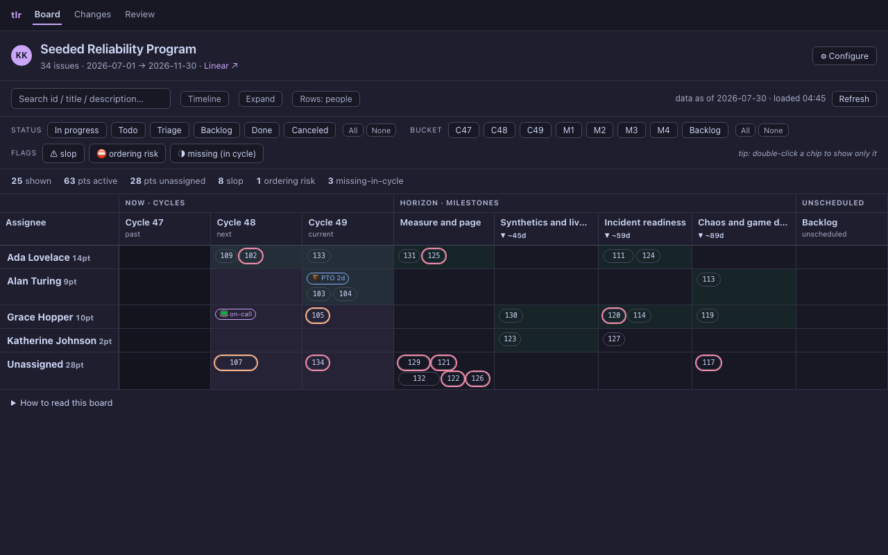
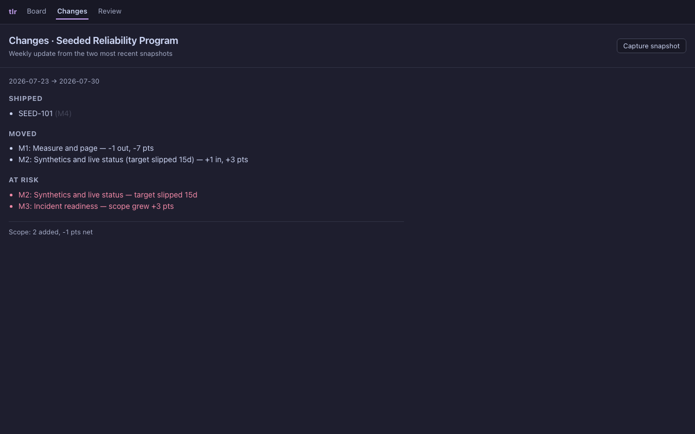
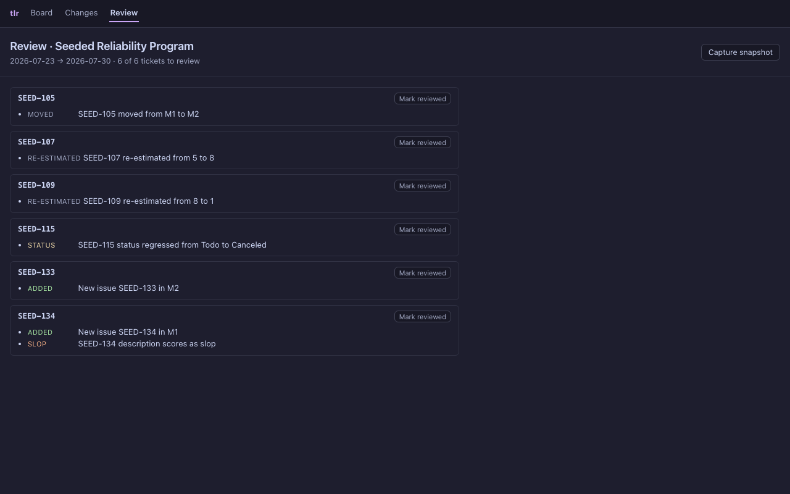

# TLR - Tech Lead Reporter

TLR, pronounced "Teller"

Linear tracks the current state of every issue. It does not tell you how the plan moved since last
week, whether a milestone will land on its target date, who is overloaded next cycle once on-call and
time off are counted, or which ticket descriptions read as AI slop. tlr answers those from the same
data. It keeps a local snapshot history so it can diff the plan over time, models per-person capacity
against the dependency graph, and gives you a reviewed, deterministic path for batch edits so AI-made
changes and sloppy text do not reach a wider audience unchecked.

One Deno/TypeScript core owns every read, the snapshot store, and the change model. A vanilla web app
and a CLI sit on top, so neither talks to Linear on its own terms. See
[ARCHITECTURE.md](ARCHITECTURE.md) for the shape, [ROADMAP.md](ROADMAP.md) for what is built and what
is next, and [AGENTS.md](AGENTS.md) for where to start.

## What it does beyond Linear

- Plan-level diff over time, the one thing Linear structurally cannot show, because its history is
  per-issue and never milestone-scope-over-time. tlr snapshots project state locally and diffs two
  captures
- Capacity forecast per person per cycle, deflated for on-call weeks (Incident.io) and days out of
  office (Google Calendar), with per-person velocity from past-cycle throughput
- Dependency waves and ordering risk from the blocking graph, so a blocker scheduled after the issue
  it blocks stands out
- Milestone slip forecast, a realistic landing date against the target from remaining scope and team
  throughput, always labeled a forecast and never a real date
- Weekly-update narrative (shipped, moved, at risk) generated from a plan-level diff
- Slop scan of ticket text for AI tells (dashes, stock phrases, checklists, length), with a review
  queue for recent edits and a way to mark each one reviewed

## The board

Capacity heat per person against cycles and milestones, with slop, ordering-risk, and missing-data
flags. Milestone headers carry a slip marker and move the detail to the hover.



Changes reads the two most recent snapshots and writes the weekly update.



Review groups every change to a ticket into one unit and lets you mark it reviewed.



Screenshots come from the end-to-end suite against seed data. They refresh only on demand, so they do
not churn on every run. Regenerate them after a UI change with `deno task screenshots`.

## Setup

```sh
mise install
deno install
hk install
```

`mise install` pins Deno, [hk](https://hk.jdx.dev) (git hooks), and [dprint](https://dprint.dev)
(JSON/Markdown/TOML formatting) to this repo's versions. `hk install` wires `hk.pkl`'s `pre-commit`
hook into git so fmt/lint/test run automatically.

See [SETUP.md](SETUP.md) for the credentials (Linear, Incident.io, Google Calendar) the data-refresh
scripts need. To run everything offline without a Linear key, `deno task seed` writes two dated
synthetic snapshots and registers a demo project, which is also what the tests use.

## Usage

The web app, at `localhost:8000`, has three pages behind a shared nav: Board (capacity and
dependencies), Changes (the weekly update), and Review (recent edits).

```sh
deno task dev              # serve the web app at localhost:8000
deno task seed             # write synthetic snapshots + a demo project into web/data (no Linear key)
deno task issues "Name"    # refresh project / cycles / milestones / issues from Linear
deno task capacity         # refresh on-call / out-days / velocity into web/data/cpu.json
deno task roster           # resolve assignee names to emails from Linear
deno task gcal:freebusy    # spike: read teammates' free/busy from Google Calendar
```

### CLI

`deno task cli` is the read-and-preview surface for Claude Code (or a person) to pull facts Linear does
not aggregate, before making a batch edit. Every command prints JSON (SVG for `export`), so it pipes
cleanly.

```sh
deno task cli scan     --project seed-b.json          # slop score per issue, or --text "<t>"
deno task cli capacity --project seed-b.json          # load vs capacity per person per cycle
deno task cli timeline --project seed-b.json          # dependency waves and ordering risks
deno task cli diff     --a seed-a.json --b seed-b.json # plan-level change between two snapshots
deno task cli report   --a seed-a.json --b seed-b.json # weekly-update narrative from a diff
deno task cli forecast --project seed-b.json          # realistic landing date per milestone
deno task cli review   --a seed-a.json --b seed-b.json # what changed worth a look since last review
deno task cli plan     --project seed-b.json --text "move SEED-105 to M2"  # guidance -> ops, preview diff
deno task cli snapshot --project seed-b.json          # capture a snapshot into the local store
deno task cli export   --project seed-b.json          # SVG of the board (or --timeline)
```

There is no MCP server by design, and none is planned. The CLI is the integration surface. If tlr is
ever hosted, the CLI can gain a mode that calls the hosted API instead of reading local files, reusing
the same handlers.

## Development

```sh
deno task test            # run unit tests
deno task test:e2e        # run the end-to-end suite (seeds data, no Linear key)
deno task screenshots     # regenerate the README screenshots on demand
deno task fmt             # format *.ts/*.js
deno task lint            # lint *.ts/*.js
deno task check           # type-check
hk run pre-commit --all   # everything the pre-commit hook runs, on the whole repo
```

Unit and VCR tests cover the ingest path, so real Linear data lands in the right shape. The
end-to-end suite runs against seed data with no live connection, so it checks that the interactions
work (a refresh would fire, an edit would call the API) rather than re-testing the data format.

## Architecture

```
src/              the core: seed (data contract), snapshot store, diff, review, ops, plan,
                  report, forecast, export, and commands/ (scan, capacity, timeline)
scripts/          data-refresh and dev-server scripts (issues, capacity, roster, serve, seed, cli)
web/              the app: app.js (board), changes.js, review.js, style.css
web/lib/          pure logic (planning.js, capacity.js), imported by both the browser and Deno tests
web/templates/    Vento page and layout templates rendered by the server
tests/            Deno unit tests plus tests/e2e Playwright smoke tests
adr/              decisions and why
```
