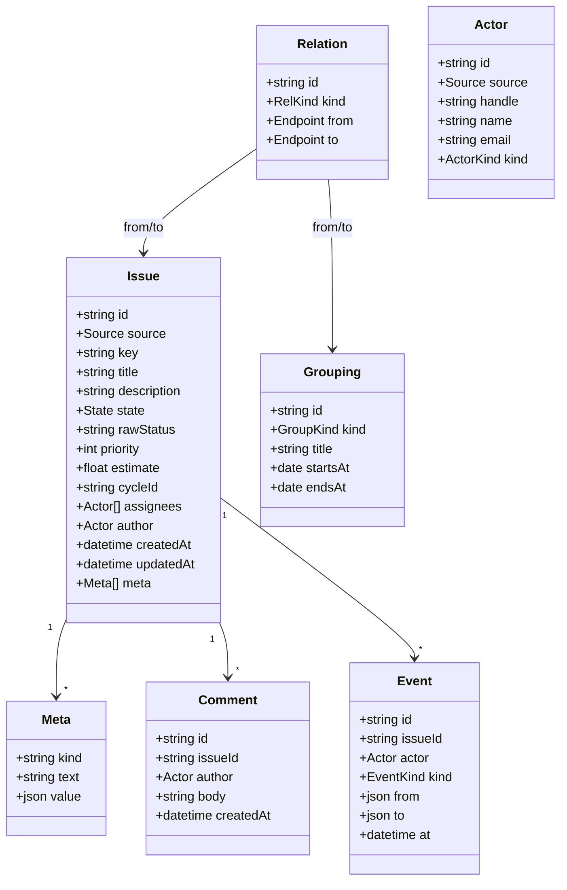

# 0006 — A normalized issue schema across trackers

- Status: proposed
- Date: 2026-07-23

## Context

TLR reads Linear today. The next tracker is GitHub, and the planning, snapshot, diff, and review code
should not branch on which one an issue came from. That only works if fetch produces one shape and the
analysis layer never sees a Linear field or a GitHub field by its native name.

The two models disagree in ways that decide the schema:

- Linear makes status, priority, estimate, and cycle intrinsic fields on the issue. GitHub keeps all
  four in a Projects v2 board as custom fields (GraphQL-only, project-scoped, lost when an issue moves
  between projects). GitHub's own issue has only `open`/`closed`
- Linear has initiatives, projects, and project milestones as first-class containers. GitHub has a
  repo-scoped milestone and a Projects v2 board, and no initiative at all
- Labels and milestones are workspace- or team-scoped in Linear, repo-scoped in GitHub, so the same
  name in two repos is two different objects
- The human key differs: Linear `DEV-8548` is workspace-unique; GitHub `#123` is unique only per repo,
  and the stable global id is the GraphQL `node_id`
- Linear users carry reliable emails. GitHub actors can be bots or import mannequins, and a real user's
  email is usually private (`null`)
- Blocks/blocked-by is a real relation on both now (GitHub shipped issue dependencies in August 2025),
  but "duplicate" on GitHub is a close-reason plus a timeline entry, not a stored edge

Linear is also rewriting parts of its own model, so the target is not fixed. Whatever we build has to
absorb a vendor changing its shape without a rewrite of the planner.

## Decision

A hybrid model: a small first-class core for the fields the planner computes on, typed `Relation`
edges, `Grouping` nodes for every container, and a `Meta` bag for the source-specific tail. Each
tracker gets an adapter that owns the mapping into this shape and nothing downstream imports a native
field.

The pieces, and why each is where it is:

- Identity is `(source, id)` where `id` is the source's stable global id (Linear issue id, GitHub
  `node_id`). The human string (`DEV-8548`, `owner/repo#123`) is a display `key`, never the primary key,
  because GitHub numbers collide across repos
- The core holds only what analysis reads on the hot path: `state`, `priority`, `estimate`, `cycleId`,
  `assignees`. `state` is a normalized enum (triage, backlog, todo, in_progress, in_review, done,
  canceled) and `rawStatus` keeps the source label so nothing is lost. Parse to the enum once at the
  boundary; trust it everywhere after
- `Grouping` is one node type for initiative, project, milestone, iteration, and release, told apart by
  `kind`. A cycle is a `Grouping(kind=iteration)` with real `startsAt`/`endsAt`; the issue also carries
  a denormalized `cycleId` because every capacity calculation needs it and a join per issue is wasteful
- `Relation` is a typed edge whose endpoints are each either an issue or a grouping. This is what makes
  grouping membership, blocking, and hierarchy the same mechanism: `member_of` links an issue to a
  milestone or a project to an initiative; `blocks`/`blocked_by`, `duplicate_of`, `related`, and
  `parent_of` link issue to issue. Store one canonical direction and derive the inverse
- `Meta` is the escape hatch, not the model. Repo labels, arbitrary Projects v2 fields, and any
  source-only attribute land here as `(kind, text, value)`. Anything the planner has to sum, sort, or
  filter on earns a first-class field instead, because a stringly-typed bag can't be computed on without
  re-parsing

### Mapping

| Standard | Linear | GitHub |
| --- | --- | --- |
| `id` | issue `id` | `node_id` |
| `key` | `identifier` (DEV-8548) | `owner/repo#number` |
| `state` / `rawStatus` | workflow `state.type` / `state.name` | `open`\|`closed` + Projects v2 "Status" select |
| `priority` | `priority` (0–4) | Projects v2 select (no native field) |
| `estimate` | `estimate` | Projects v2 number field (often absent) |
| `cycleId` | `cycle` | Projects v2 iteration field |
| `assignees` | `assignee` (one) | `assignees` (many) |
| `Grouping` | initiative, project, projectMilestone | milestone (repo), ProjectV2 board |
| `Relation` blocks | issue `relations` | issue dependencies (GA 2025-08) |
| `Relation` parent | `parent` / `children` | sub-issues |
| labels | workspace/team labels | repo labels (→ `Meta` tags) |
| `Comment` | comments | `IssueComment` |
| `Event` | history entries | `timelineItems` (typed nodes) |
| `Actor` | user (email reliable) | actor (`login`+`id`, email usually null) |

The GitHub adapter carries the weight here. Because status, priority, estimate, and cycle live in a
Projects v2 board, that adapter needs a project selector plus a field-name map (which select is
"Status", which number field is "Estimate"), and it has to treat all four as possibly-absent. The Linear
adapter reads them straight off the issue.

## Alternatives considered

- Thin superset, the union of both models with no normalization. Simplest fetch, but every consumer
  branches on `source`, which is the coupling this whole ADR exists to prevent
- Full generic attribute model, the `Meta`-everything design where even title and estimate are
  `(kind, text)` rows. Most flexible and the closest to the "Meta + MetaKind" sketch, but you cannot
  type-check or compute a capacity number without re-parsing strings, so it fails the planner. Kept only
  as the escape hatch for the long tail
- Adopt Linear's model as canonical and coerce GitHub into it. Fast today, but it bakes in initiatives
  and cycles GitHub cannot fill, and it pins us to a vendor that is actively reshaping its own model

The recommended hybrid puts the volatility in adapters and keeps the core small, which is the hedge
against both a new tracker and a vendor rewrite.

## Consequences

- Analysis, snapshot, diff, and review code targets one shape. Adding a third tracker is a new adapter,
  not a change to the planner
- Normalized `state` can drift from a source that renames or restructures its statuses. `rawStatus` and
  a retained raw payload let us re-derive without a re-fetch when the mapping changes
- GitHub's planning fields are project-scoped and non-portable, so an issue with no project item has no
  estimate, priority, status, or cycle. The board has to show "unset" honestly rather than inventing a
  default
- Grouping-via-relations costs a join for a common question ("what milestone is this issue in"). The
  denormalized `cycleId` covers the hottest path; add more denormalized refs only when a real query is
  slow
- Identity across sources stays unsolved. One human is two `Actor` rows (one per source) until we link
  them, and email is the only bridge, which GitHub often hides. The roster (ADR 0005) already keys on
  email, so cross-source linking can reuse it when emails exist
- The write layer (Phase 2) inherits the split: one normalized op ("set estimate") is a field write on
  Linear and a Projects v2 item-field update on GitHub. The adapter that maps reads has to map writes
  back the same way

## References

- GitHub issue dependencies GA: https://github.blog/changelog/2025-08-21-dependencies-on-issues/
- GitHub Projects v2 via the API: https://docs.github.com/en/issues/planning-and-tracking-with-projects/automating-your-project/using-the-api-to-manage-projects
- GitHub GraphQL issues reference: https://docs.github.com/en/graphql/reference/issues
- GitHub sub-issues REST: https://docs.github.com/en/rest/issues/sub-issues
- Linear API (issues, relations, cycles): https://developers.linear.app/docs
