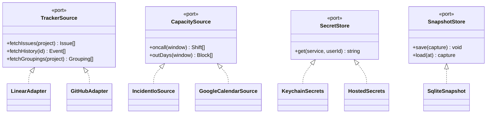

# 0007 — Productizing the spikes into domains and ports

- Status: proposed
- Date: 2026-07-23

## Context

The working pieces reached today are spikes. The web board, the capacity fetcher, and the roster
resolver each proved an idea by taking a shortcut: the board reads a static JSON file, capacity out-days
arrive through the Google Calendar MCP inside a Claude session, and secrets sit in the local keychain.
Every shortcut was the right call for proving the slice. None of them survives a second user on a shared
runner.

The risk now is that the spikes calcify as one-offs, with the MCP handoff and the keychain reads wired
straight into callers. Then productionizing means rewriting the callers instead of swapping a back end.
This ADR sets the shape the spikes migrate into so that a shortcut is always replaceable in one place,
and so the move from "my laptop" to "a hosted runner, per user" is a configuration change.

The normalized model in [ADR 0006](0006-normalized-tracker-schema.md) is the shared vocabulary this
depends on. The [ARCHITECTURE](../ARCHITECTURE.md) sketch of one core and two front-ends is the starting
point; this ADR names the boundaries inside that core.

## Decision

Four domains over a shared kernel, with every outside dependency reached through a port.

| Domain   | Owns                                                             | Pure?                |
| -------- | ---------------------------------------------------------------- | -------------------- |
| Ingest   | tracker adapters, fetch, normalize to the ADR 0006 model         | no (I/O at the edge) |
| Snapshot | persist state, `diff` between captures, `review` since last look | no (storage)         |
| Planning | buckets, capacity, chain risk, slop scan                         | yes                  |
| Delivery | CLI and web, rendering, interaction                              | no (presentation)    |

The kernel holds the normalized types, config, and the port interfaces. Domains depend inward on the
kernel; delivery depends on domains; adapters implement ports; the planning domain imports no I/O at all,
which is already true of `web/lib/planning.js` and `web/lib/capacity.js` and stays true.



Where each spike lands:

| Spike today                                                       | Migrates to                                         |
| ----------------------------------------------------------------- | --------------------------------------------------- |
| `web/lib/planning.js`, `web/lib/capacity.js` (pure)               | Planning domain, unchanged                          |
| `scripts/capacity.ts` on-call fetch                               | `IncidentIoSource` behind `CapacitySource`          |
| `scripts/capacity.ts` gcal live free/busy fetch (or handoff file) | `GoogleCalendarSource` behind `CapacitySource`      |
| `scripts/roster.ts`                                               | Ingest identity resolution (a `TrackerSource` read) |
| `web/app.js`, `scripts/serve.ts`                                  | Delivery (web)                                      |
| `src/tlr/` (Python reader)                                        | replaced by the Ingest Linear adapter, then removed |

### The spike-versus-productionize rule

A shortcut is allowed only behind a port. The caller talks to `CapacitySource`; whether out-days come
from an MCP handoff file today or an OAuth client tomorrow is the adapter's problem. That single rule is
what keeps the MCP shortcut from leaking into the merge and keeps the keychain read out of the fetch
loop. Productionizing a spike then means writing the real adapter and deleting the shortcut one, with no
change above the port.

Concretely for the two live shortcuts:

- Google Calendar. `GoogleCalendarSource.outDays()` is satisfied today by reading the handoff file the
  MCP step writes. The real adapter runs the OAuth or service-account flow from
  [SETUP.md](../SETUP.md) and returns the same `Block[]`. The capacity merge never learns which one ran
- Secrets. `KeychainSecrets.get(service, userId)` ignores `userId` and reads the local keychain.
  `HostedSecrets.get(service, userId)` reads a per-user namespaced secret. The run carries a user id
  either way, so the same adapters fetch per-user credentials once the store is swapped

### A refresh on a hosted runner

```mermaid
sequenceDiagram
  participant Run as Runner (per user)
  participant Sec as SecretStore
  participant Ing as Ingest
  participant Cap as CapacitySource
  participant Snap as SnapshotStore
  Run->>Sec: get(linear, userId)
  Sec-->>Run: key
  Run->>Ing: fetch + normalize (TrackerSource)
  Ing-->>Run: Issue[] / Grouping[] / Event[]
  Run->>Cap: oncall + outDays(window)
  Cap-->>Run: Shift[] / Block[]
  Run->>Snap: save(capture)
  Note over Run,Snap: Planning reads the capture; no adapter imports touch it
```

The only difference between local and hosted is which `SecretStore` and which `CapacitySource` adapters
are bound, plus a loop over user ids. Nothing in ingest, planning, or snapshot changes.

## Alternatives considered

- Leave the spikes as scripts and wire real back ends into them in place. No new indirection, but the
  MCP handoff and keychain reads stay welded to callers, so the hosted move is a rewrite. This is the
  outcome the ADR exists to avoid
- Full hexagonal layering now, ports for every collaborator including the ones with a single
  implementation. Clean on paper, but most of those ports would guard a boundary that never gets a
  second adapter, which is abstraction for its own sake

The line drawn here: a port earns its place when a second implementation is real or scheduled. Trackers
(Linear now, GitHub next) qualify, capacity sources qualify (two already), and the secret store
qualifies (hosted is planned). Anything else stays a plain function until a second caller shows up.

## Consequences

- Each shortcut is quarantined behind one interface, so productionizing is an adapter swap and a delete,
  not a caller rewrite
- Vendor churn from [ADR 0006](0006-normalized-tracker-schema.md) is contained in tracker adapters; the
  planner never sees it
- Local-to-hosted is a `SecretStore` binding plus a per-user run loop, which is why every credential in
  [SETUP.md](../SETUP.md) is framed as one named secret per service per user
- Ports cost indirection and a little ceremony per new source. That is the accepted price for containing
  churn and the hosting move; the guard against overpaying is the "second implementation is real" rule
- The Python reader stays only until the ingest Linear adapter replaces it, then it goes, per the
  current [ARCHITECTURE](../ARCHITECTURE.md) note
